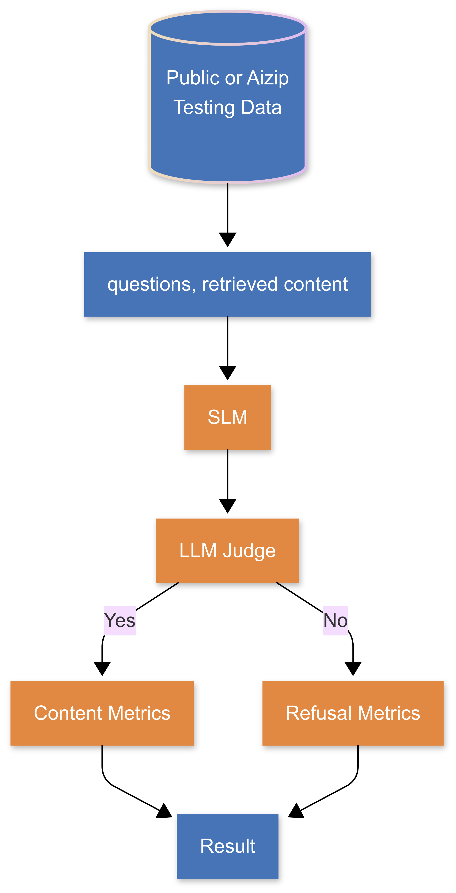

<p align="left">
  
</p>

# RED-flow: Pipeline for RAG Evaluation


RED-flow is a framework for evaluating Small Language Models (SLMs) on retrieval-augmented generation (RAG) tasks. This system enables batch evaluation of model performance using GPT-4 as a judge on various quality metrics.

## Overview
<p align="center">
  
</p>

RED-flow provides an end-to-end pipeline for:
1. Loading datasets containing queries and contexts
2. Running inference with target models locally
3. Evaluating responses using GPT-4o on customizable metrics
4. Processing and storing results

The system supports caching to avoid redundant model inference.

## Features

- Support for huggingface or local models
- Customizable evaluation metrics 
- Batched evaluation using OpenAI's batch API for cost efficiency

## Metrics

The system includes the following evaluation metrics for quick-start:

- **Query Relevance**: Measures how relevant the response is to the query
- **Query Completeness**: Assesses how thoroughly the response answers the query
- **Context Adherence**: Evaluates how much the response is based on the provided context
- **Context Completeness**: Measures how much of the relevant context is used
- **Response Coherence**: Rates the overall readability and coherence
- **Response Length**: Evaluates appropriateness of the response length
- **Refusal Quality**: Scores how well a model explains a refusal to answer
- **Refusal Clarification Quality**: Evaluates any clarification questions asked during refusal

## Installation

Install or create an environment with Python 3.11+

- e.g. `conda create -n env_name python=3.11`

- Install from `requirements.txt`

```bash
pip install -r requirements.txt
```

- **NOTE:** We recommend Flash Attention 2 for efficiency reasons.  

## Usage

### Demo Notebook

- See `demo.ipynb` for details.
- Remember to make a HuggingFace account to run gated models!

### From Shell

```bash
./run.sh --data_path "/path/to/data.jsonl" \
         --model_name "/path/to/model" \
         --input_column "your query column" \
         --document_column "your document column" \
         --sample_size 10 \
         --metric "query relevance"
```

### Direct Python Usage

```bash
python REDEvaluator.py \
    --data_path "/path/to/data.jsonl" \
    --model_name "/path/to/model" \
    --input_column "your query column" \
    --document_column "your document column" \
    --sample_size 10 \
    --batch_size 8 \
    --metric "query relevance" 
```

- Check `util/prompts.py` for the keys of included metrics!  

## File Structure

- `generic_model_eval.py`: Main evaluation framework
- `utils/prompts.py`: Prompt templates and metric definitions
- `run.sh`: Convenience shell script for running evaluations

## Output Directories

- `./batch_requests/`: Stores batch evaluation requests
- `./batch_results/`: Stores model outputs and batch results
- `./eval_results/`: Contains final evaluation results

## Requirements

- OpenAI API access
- Python 3.11+
- Required packages: transformers, torch, pandas, tqdm, openai

## Environment Variables

- `OPENAI_API_KEY`: Your OpenAI API key (can also be passed as a parameter)

## Contributing

Contributions to RED-flow are welcome! Feel free to submit pull requests or open issues for bugs, feature requests, or documentation improvements.
